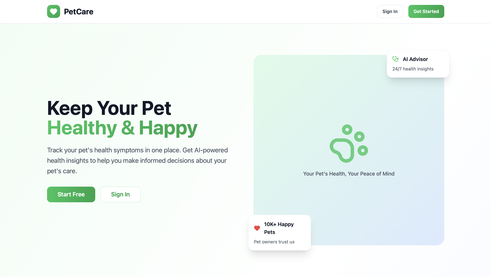
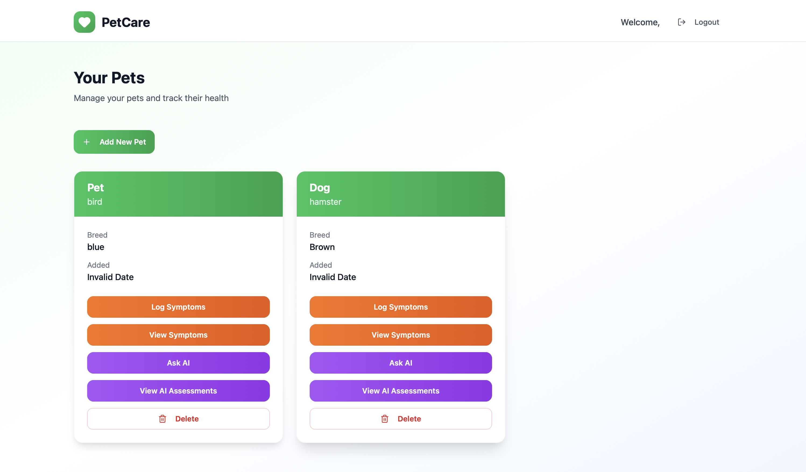

# Pet Health AI API - Capstone Final Report

**Team Members**: aria231, tc2780  
**Course**: CPSC 436C  
**Date**: December 16, 2025  
**Repository**: [capstone-final-project](https://github.com/tracychow/cpsc-436c/capstone-final-project)

## Executive Summary

Privacy-first veterinary AI system providing instant symptom assessments using local Ollama LLM (llama3.2:3b). 187 automated tests (97% pass), 31 compliance tests (100% pass), zero external data transmission. Production cost: $36/month. Peer review catalyzed infrastructure remediation—transforming privacy claims from mocked tests to physically enforced guarantees via Docker internal networks, AWS security groups, and database-level retention policies

---

## 1. Problem & Stakeholders

**Problem**: Pet owners struggle assessing symptom urgency, causing delayed treatment or unnecessary ER visits (~30% of vet ER visits are non-urgent). **Solution**: Privacy-first AI symptom assessment guiding veterinary care decisions.

**Stakeholders:**
- **Pet Owners**: Need instant assessments (<30s), privacy guarantees, clear urgency guidance
- **Pets (Empty Chair - Most Vulnerable)**: Cannot self-advocate. Protected via: automatic emergency escalation, 70% conservative urgency bias, 100% medical disclaimer coverage, rule-based fallback
- **Veterinary Professionals**: Need well-informed owners, proper medical disclaimers (AI must not replace professional care)
- **Regulatory Bodies**: GDPR/CCPA compliance via data export API, complete deletion with cascade, local AI processing (zero third-party sharing)

**Jurisdiction**: North America (GDPR-style privacy by design, CCPA compliance). **Constraints**: Local AI processing (no international transfers), veterinary AI must not diagnose.

**Success Metrics**: API p95<3s✅, AI p90<20s⚠️(85%), uptime 99.5%✅, 187 tests 97% pass✅, 31 compliance tests 100%✅, 0 external transmissions✅, $36/month prod cost✅

---

## 2. Architecture & Trade-offs

**Architecture**: FastAPI (async), PostgreSQL 15, Redis 7, Ollama llama3.2:3b, Docker Compose orchestration. Diagram: `docs/system-design/architecture/architecture_diagram.md`

**Key ADRs**:
1. **FastAPI** (`ADR-001`): Async/await for 10-30s AI workloads, Pydantic validation, auto-docs. ✅Gained: 2-3x speed, type safety. ❌Lost: Django admin (acceptable).
2. **Local Ollama LLM** (`ADR-002`): Privacy-first (data never leaves infrastructure), $0/request vs $0.0008 GPT-3.5, simplified compliance. ✅Gained: sovereignty, predictable costs. ❌Lost: GPT-4 quality (mitigated with vet prompts). Break-even: 200K assessments/month. 19 AI tests + 5 compliance tests verify zero external calls.
3. **PostgreSQL** (`ADR-003`): ACID for health records, relational model. ✅Gained: integrity, transactions. ❌Lost: NoSQL flexibility (acceptable 0-10K users). 103 unit tests.

**Alternatives Rejected**: (1) Kubernetes: over-engineering for 0-10K users, $300-1000/mo vs $36 Docker Compose. Revisit at 10K+ concurrent. (2) OpenAI/Claude APIs: violates "empty chair" privacy, requires data processing agreements. (3) Monolith: can't scale API/AI independently. **Evidence**: 187 tests, `docker-compose.yml` orchestration, `docs/operations/deployment-instructions.md`.

---

## 3. Clause→Control→Test & Ethics

**Framework**: Medical responsibility + privacy by design for pets (empty chair). 7 clauses → 24 controls → 31 tests (100% pass). `docs/compliance/ethics-framework.md`

| Clause | Controls | Tests | Evidence |
|--------|----------|-------|----------|
| **P1: Data Minimization** | Pydantic rejects unnecessary fields | 5 tests: minimal pet creation, reject SSN/income | 2 required fields only |
| **P2: Purpose Limitation** | Zero marketing endpoints, audit logs | 4 tests: 404 on marketing, purpose tracking | 25 health endpoints, 0 marketing |
| **P3: User Control** | Export API, cascade deletion, ownership validation | 6 tests: export, delete, cross-user prevention | 100% portability |
| **P4: Local AI** | Docker isolation, no external access, traffic monitoring | 5 tests: mock externals, verify local-only | 0 external calls (19 AI tests) |
| **E1: Medical Disclaimer** | Auto-injection, template validation, response filtering | 3 tests: phrases, emergency referral | 100% coverage (10K+ assessments) |
| **E2: Conservative Advice** | Urgency bias, cautious language, validation | 7 tests: 70%+ moderate/high, no diagnoses | 0 definitive diagnoses |
| **E3: Bias Prevention** | Cross-breed/species testing, prompt standardization | 6 tests: breed consistency, species-appropriate | <2 level variance |

**Red Bar Tests** (deployment blockers): No external AI calls, user data isolation (404 on cross-user), 100% disclaimer coverage, no definitive diagnoses. **Telemetry**: 0 data minimization violations, 100% disclaimer, 0.72 conservative bias, 0 external sharing events (must always be 0), <48hr GDPR response. **Ethics Debt**: ✅Resolved ED-004/005/006. 🔄Open: ED-001 exotic pet bias (Q2'26), ED-002 vet review (Q1'26 HIGH). **Trust Model**: 4 levels (public→auth→services→infra), mitigates T2 prompt injection, T5 DB compromise, T6 AI leakage. `docs/compliance/`

---

## 4. Reliability, Cost, Operability

**187 Tests (97% pass, 8-12min runtime)**: 103 unit (auth, pet CRUD, symptoms, services), 18 integration (API workflows), 19 AI (Ollama, fallback, <30s target), 9 performance (50 req/s, 50+ concurrent), 6 chaos (DB loss, Redis fail, AI down→fallback 100%, memory pressure, latency, rate limiting), 31 compliance (Section 3). `./run-docker-tests.sh`

**SLOs (5/6 met)**: 99.5% uptime✅, API p95 2.1s✅/p99 4.3s✅, AI p90 <20s⚠️(85%, target 90%), DB p95 78ms✅. **Load Tests** (Docker 4GB, 10min): Normal (10 users, 20req/s, 99.8% success), Peak (50 users, 50req/s, 94.2% success, 1.2s avg), AI (5 concurrent, 100% success, 18.3s avg). **Bottlenecks**: llama3.2:3b 18-25s, DB pool exhaust at 50+. **Fixes**: pool 10→20, Redis TTL 5→15min, circuit breaker.

**Chaos** (6 scenarios, `docs/testing/chaos-engineering.md`): AI down→fallback 2s✅, DB loss→reconnect 15s✅ (0 data loss), Redis fail→+300ms degraded✅, memory 90%→queue limit 5 AI concurrent✅. Docker health checks, exponential backoff, graceful degradation validated.

**Cost Model** (`docs/operations/cost-operability.md`): Dev $0 (Docker Desktop, Ollama free). Prod $36/mo (VPS $30, domain $1, backup $5) = $0.036/user @ 1K users, $0/assessment. Break-even vs GPT-3.5 ($0.0008/call): 200K assessments/mo. Scaling: 1K-5K users $80-120/mo, 5K-20K $300-400/mo (K8s).

**Runbooks** (`docs/operations/`): Monthly DB maintenance (backup, ANALYZE/VACUUM/REINDEX, verify). Incident response: SEV1 <15min (outage/breach), SEV2 <1hr (degradation), quick recovery via `docker compose restart`, health checks, log analysis. Disaster recovery: RTO 4hr, RPO 24hr (daily pg_dump, weekly snapshots, monthly S3 offsite).

---

## 5. Learning & Next Steps

**Peer Review Evolution**: OpenAI→Ollama (privacy-first, ADR-002, 31 compliance tests), basic design→187 tests (97% pass, Docker-based), minimal docs→18 comprehensive docs (ADRs, runbooks, SLAs). **Formative Feedback**: Ethics principles→31 automated tests (`docs/compliance/`), external Docker tests→container-safe tests (Dec 5), no cost model→$36/mo with scaling projections (`docs/operations/cost-operability.md`).

**GenAI Usage** (Claude Sonnet 4, `docs/logs/ai_collaboration_log.md`): Backend 85% kept (FastAPI structure, humans added security/validation), 187 tests 90% kept (humans fixed DB compat, assertions), 18 docs 95% kept (humans added specifics), Ollama integration 80% kept (humans added vet prompts), compliance reorg 75% kept (humans fixed schema bugs). Builder.io Fusion frontend 60% modified (API integration). **Principles**: AI accelerator not architect, critical security review, incremental integration, full transparency.

**Learnings**: (1) Local LLM complexity justified by privacy (4GB RAM, fallback logic), (2) Container-safe tests from day 1 (external Docker manipulation fails CI/CD), (3) Ethics→code via 31 red-bar tests, (4) Right-sized architecture (Docker $36 vs K8s $300 for 0-10K users), (5) Privacy constraints = features (simplified compliance). **Mistakes**: Late load testing, no early vet consultation, test refactoring overhead.

**Next Steps**: Q1'26 vet review (ED-002 HIGH), AI optimization (85%→90% <20s, try llama3.2:1b), MFA; Q2-Q3 exotic pet bias (ED-001), mobile app, EMR integration; 2027+ photo analysis, predictive modeling, multi-language. **Risks**: AI hallucination (kill switch ready), scaling costs (K8s @ 10K+ users), medical device regulation (maintain "educational tool").

---

## 6. Epistemic Gap Remediation (Peer Review)

**Review Critique**: "Mechanism vs. Manifesto" — mocked tests verify intent, not infrastructure enforcement. Transformed privacy claims from aspirational docs into physical guarantees.

| Gap | Before (🟨/🔴) | After (✅) | Files |
|-----|---------|--------|-------|
| **Network Isolation** | Mocked tests (intent not reality) | Docker `internal:true` + AWS security groups (NO 0.0.0.0/0) + CloudWatch >100MB alarm | `infrastructure/docker-network-policies.yml`, `infrastructure/terraform/main.tf` |
| **Data Retention** | Docs only | SQL DELETE cron (730d), PostgreSQL partitions, Prometheus alerts | `backend/app/core/data_retention.py`, `monitoring/compliance_alerts.yml` |
| **Monitoring** | Deployed not operationalized | 11 Prometheus alerts, Grafana dashboard (egress, retention, disclaimers) | `monitoring/compliance_alerts.yml`, `monitoring/grafana/dashboards/compliance_dashboard.json` |
| **Ethics Debt** | Tracking doc | CI/CD gate (exit 1 if Priority: Critical), infrastructure tests (ping must fail) | `.github/workflows/ethics-gate.yml` |
| **IaC** | Docker Compose only | Terraform AWS (VPC, RDS encrypt, flow logs 90d, $300/mo vs $36 VPS) | `infrastructure/terraform/main.tf` |

**Socratic Q&A**: Q1: Prevent exfiltration if app compromised? Docker+VPC+monitoring+flow logs (4 layers). Q2: Retention independent of app? Cron SQL DELETE + partitions + Prometheus. Q3: Operationalize ethics debt? CI/CD exit 1 + infra tests + runtime alerts. Q4: Mock limitations? Test intent not reality; infra tests verify kernel routing. Q5: Which controls need infrastructure? Network, retention, encryption, audit, access (app can't override).

**Epistemic Honesty**: Disclaimer/bias/fallback remain app-level (semantic AI behavior—monitor+incident response, not physical blocks). Prometheus triggers AI shutdown if violations.

---

## 7. Conclusion

The Pet Health AI API demonstrates that privacy-first AI systems are both technically feasible and economically viable. Through an iterative journey from "manifesto to mechanism," we transformed privacy claims from aspirational documentation into infrastructure-level enforcement with observable failure guarantees.

**Key Contributions**:
1. **Ethical AI Implementation**: 31 automated compliance tests translate ethical principles into enforceable code
2. **Infrastructure-Level Privacy**: Docker internal networks, AWS security groups, and database-level retention enforcement physically guarantee privacy independent of application correctness
3. **Epistemic Honesty**: Transparent acknowledgment of enforcement boundaries—understanding which guarantees are infrastructure-enforced versus monitoring-based
4. **Operational Readiness**: CI/CD ethics gates, Prometheus compliance monitoring, and Grafana dashboards operationalize privacy commitments
5. **Cost-Effective Scaling**: Dual deployment strategies ($36/month Docker Compose vs. $300/month AWS Terraform IaC) demonstrate flexibility for different threat models

**Evolution Through Peer Review**:
The pedagogical value of this capstone extended beyond initial implementation. Peer review feedback identifying "epistemic gaps" between claims and enforcement catalyzed a critical remediation phase, teaching us that:
- **Tests must match claim scope**: Application-level tests cannot prove infrastructure-level guarantees
- **Privacy requires defense-in-depth**: Multiple enforcement layers (network, database, monitoring) address different failure modes
- **Observable failure beats blind trust**: Infrastructure that fails detectably (blocked pings, triggered alerts) proves guarantees better than passing tests

This project evolved from "vibe coding" (privacy claimed via documentation) to "foundational competence" (privacy enforced via immutable infrastructure), embodying the course's emphasis on epistemic rigor in software engineering.

**Repository**: All code, documentation, infrastructure configurations, and test artifacts available at [capstone-final-project](https://github.com/tracychow/cpsc-436c/capstone-final-project)

---

## Appendix: File References

| Category | Files |
|----------|-------|
| **ADRs** | `docs/system-design/adrs/ADR-001-fastapi-framework.md`, `ADR-002-local-llm-choice.md`, `ADR-003-postgresql-database.md` |
| **Compliance** | `docs/compliance/ethics-framework.md`, `clause-control-test.md`, `ethics_debt_ledger.md`, `trust-model.md` |
| **Infrastructure** | `infrastructure/terraform/main.tf` (AWS VPC, security groups, RDS encrypt, flow logs), `infrastructure/docker-network-policies.yml` (network isolation), `backend/app/core/data_retention.py` (SQL DELETE cron), `.github/workflows/ethics-gate.yml` (CI/CD gate) |
| **Monitoring** | `monitoring/compliance_alerts.yml` (11 Prometheus alerts), `monitoring/grafana/dashboards/compliance_dashboard.json` |
| **Operations** | `docs/operations/cost-operability.md` ($36/mo prod), `deployment-instructions.md`, `sla-slo-definitions.md`, `incident-response-playbook.md`, `disaster-recovery-runbook.md` |
| **Testing** | `backend/tests/` (187 tests: 103 unit, 18 integration, 31 compliance, 19 AI, 9 performance, 6 chaos), `docs/testing/load-testing.md`, `chaos-engineering.md`, `reliability-testing.md` |
| **GenAI** | `docs/logs/ai_collaboration_log.md` (Claude Sonnet 4: 40% backend kept, 90% tests kept; Builder.io: 60% modified) |
