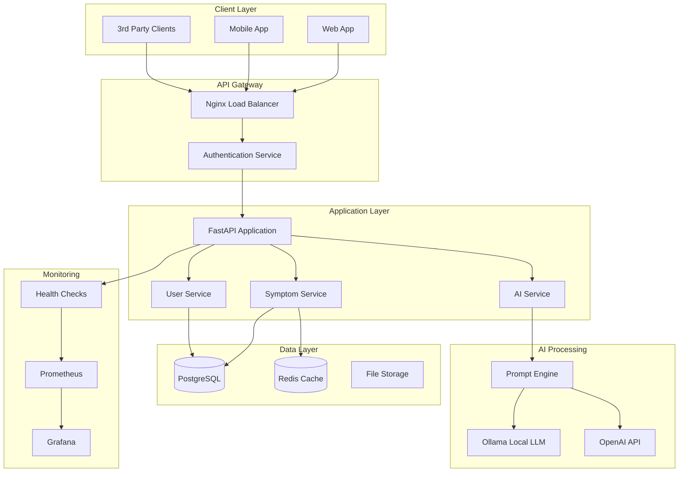
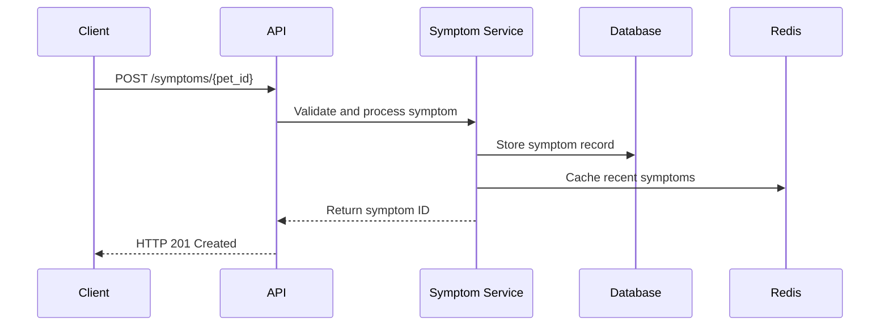
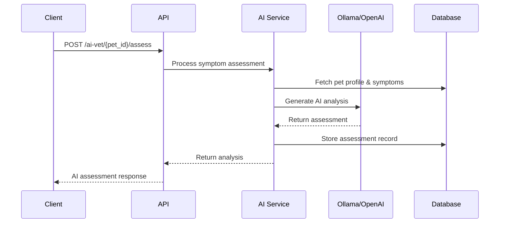

# Pet Health API - Architecture Diagram

## System Overview



## Component Details

### **API Gateway Layer**
- **Nginx**: Load balancing, SSL termination, rate limiting
- **Authentication**: JWT-based authentication with Redis session storage

### **Application Services**
- **FastAPI**: Async Python web framework for high performance
- **Symptom Service**: Core business logic for symptom tracking
- **AI Service**: AI integration and prompt management
- **User Service**: User and pet profile management

### **AI Processing Pipeline**
- **Prompt Engine**: Structured prompt generation and validation
- **Ollama**: Privacy-first local LLM processing
- **OpenAI**: Optional cloud AI for enhanced capabilities

### **Data Architecture**
- **PostgreSQL**: Primary data store with ACID compliance
- **Redis**: Caching layer and session management
- **File Storage**: Pet images and documents

### **Observability Stack**
- **Prometheus**: Metrics collection and alerting
- **Grafana**: Visualization and dashboards
- **Health Checks**: Comprehensive service monitoring

## Data Flow

### **Symptom Tracking Flow**


### **AI Assessment Flow**


## Deployment Architecture

### **Development Environment**
```yaml
Local Development:
  - Docker Compose with all services
  - Ollama running locally
  - PostgreSQL and Redis containers
  - Hot reload for development
```

### **Production Environment**
```yaml
Cloud Deployment:
  - Kubernetes cluster or container platform
  - Managed PostgreSQL database
  - Redis cluster for high availability
  - Load balancer with SSL termination
  - Horizontal pod autoscaling
```

## Security Architecture

### **Authentication & Authorization**
- JWT tokens with refresh mechanism
- Role-based access control (RBAC)
- Pet ownership validation
- API rate limiting per user

### **Data Protection**
- Encryption at rest (database level)
- Encryption in transit (TLS 1.3)
- PII anonymization for research data
- GDPR compliance measures

### **AI Security**
- Local LLM processing (data never leaves infrastructure)
- Prompt injection protection
- Response validation and filtering
- Audit logging for AI interactions

## Scalability Considerations

### **Horizontal Scaling**
- Stateless API design
- Database connection pooling
- Redis clustering for cache
- CDN for static assets

### **Performance Optimization**
- Database indexing strategy
- Intelligent caching layers
- Async request processing
- Connection pooling

### **Monitoring & Alerting**
- Real-time health monitoring
- Performance metrics tracking
- Error rate monitoring
- Capacity planning alerts