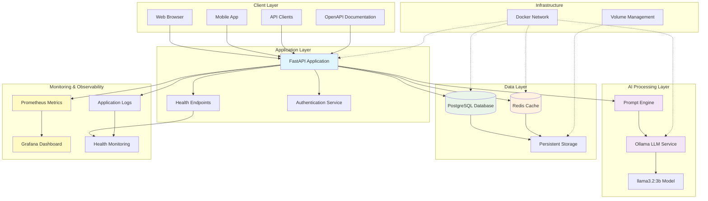
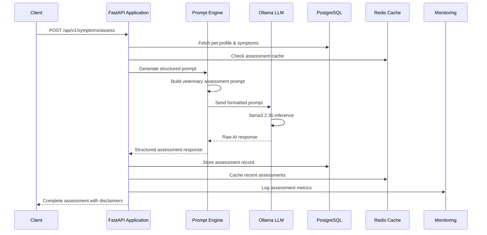
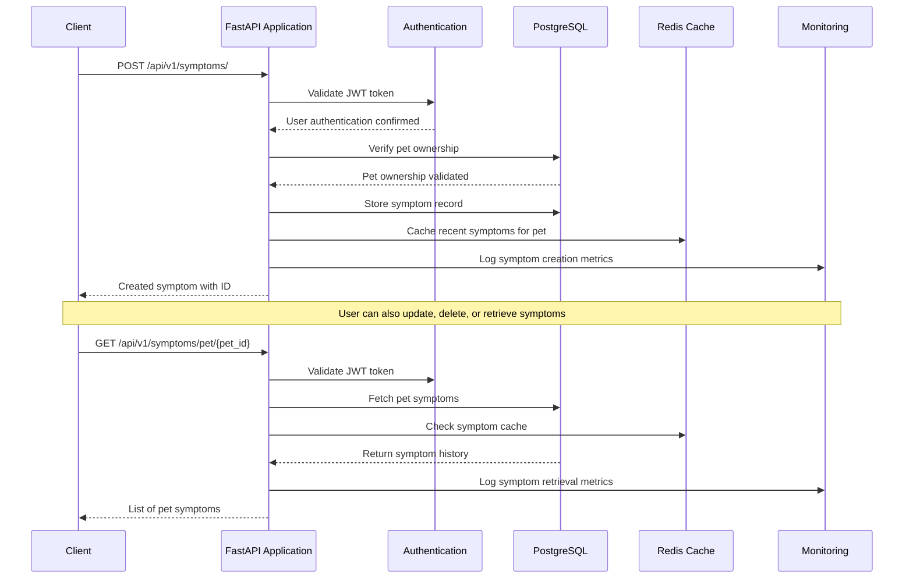
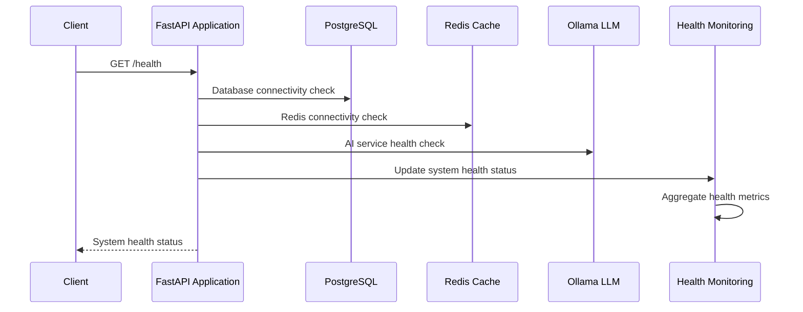

# Pet Health API - Architecture Diagram

## System Architecture Overview



## Component Architecture Details

### **Application Layer Components**
- **FastAPI Application**: Async Python web framework handling all API requests
- **Authentication Service**: JWT-based authentication and user session management
- **Health Endpoints**: System health monitoring and service status checks

### **AI Processing Pipeline**
- **Prompt Engine**: Intelligent prompt generation and veterinary context formatting
  - Structures pet health data into effective LLM prompts
  - Handles medical domain-specific prompt engineering
  - Manages response parsing and validation
- **Ollama LLM Service**: Local language model processing for privacy-first AI
- **llama3.2:3b Model**: Specialized 3B parameter model optimized for medical assessments

### **Data Architecture**
- **PostgreSQL Database**: Primary data store with ACID compliance for critical pet health data
- **Redis Cache**: High-performance caching layer for sessions and frequent queries
- **Persistent Storage**: Volume management for database and AI model persistence

### **Monitoring & Observability**
- **Application Logs**: Comprehensive logging for debugging and audit trails
- **System Metrics**: Performance monitoring and resource utilization tracking
- **Health Monitoring**: Real-time service health checks and availability monitoring
- **Error Alerting**: Automated alert system for critical failures and anomalies

### **Infrastructure Layer**
- **Docker Network**: Containerized service orchestration and network isolation
- **Volume Management**: Persistent data storage across container lifecycles

## System Configuration

### **Service Architecture**
```yaml
Application Services:
  - FastAPI: RESTful API with async request handling
  - Authentication: JWT token management and user sessions
  - Prompt Engine: AI prompt generation and response processing
  
Data Services:
  - PostgreSQL: Primary database with transactional integrity
  - Redis: Caching layer with session management
  
AI Services:
  - Ollama: Local LLM inference engine
  - Model Storage: Persistent model and configuration storage
  
Monitoring Services:
  - Health Checks: Service availability monitoring
  - Metrics Collection: Performance and usage analytics
  - Log Aggregation: Centralized logging and audit trails
```

### **Data Flow Architecture**
```yaml
Request Processing:
1. Client authentication and authorization
2. Request validation and routing
3. Business logic processing
4. Data persistence operations
5. Response formatting and delivery

AI Assessment Pipeline:
1. Pet health data retrieval
2. Prompt engineering and generation
3. LLM inference processing
4. Response parsing and validation
5. Result caching and storage

Monitoring Pipeline:
1. Request logging and metrics collection
2. Performance monitoring and alerting
3. Health status aggregation
4. Error tracking and notification
```

## Current Data Flow

### **AI Assessment Workflow**


### **Symptom Tracking Flow**


### **Health Check Flow**


## Deployment Architecture

### **Development Environment**
```yaml
Local Development:
  Platform: Docker Compose orchestration
  Services: All components running on single machine
  Database: PostgreSQL with development data
  AI Processing: Local Ollama with llama3.2:3b model
  Caching: Redis for development optimization
  Monitoring: Basic health checks and logging
  
Development Features:
  - Hot reload for rapid development
  - Comprehensive test suite integration
  - Interactive API documentation
  - Real-time log monitoring
```

### **Production Environment**
```yaml
Production Deployment:
  Platform: Cloud VPS or container orchestration
  Architecture: Scalable multi-container deployment
  Database: PostgreSQL with backup and replication
  AI Processing: Optimized Ollama with resource allocation
  Load Balancing: Nginx reverse proxy with SSL termination
  Monitoring: Full observability stack with alerting
  
Production Features:
  - Horizontal scaling capabilities
  - Comprehensive monitoring and alerting
  - Automated backup and recovery
  - Security hardening and compliance
```

### **Scalability Considerations**
```yaml
Horizontal Scaling:
  - API layer: Multiple application instances behind load balancer
  - Database: Read replicas and connection pooling
  - AI Processing: Multiple Ollama instances for load distribution
  - Caching: Redis cluster for high availability
  
Performance Optimization:
  - Database indexing and query optimization
  - Intelligent caching strategies
  - AI response caching for similar assessments
  - Asynchronous request processing
```

## Security and Privacy Architecture

### **Container Security**
- **Network Isolation**: Services communicate via Docker internal network
- **Secret Management**: Environment variables and Docker secrets
- **Image Security**: Official base images with minimal attack surface
- **User Privileges**: Non-root container execution where possible

### **Data Protection**
- **Local AI Processing**: All inference happens within Docker network
- **Encryption**: TLS for external connections, encrypted volumes
- **Access Control**: JWT-based authentication and authorization
- **Data Retention**: Configurable retention policies for assessments

### **Privacy-First Design**  
- **No External AI Calls**: Ollama processing stays local
- **GDPR Compliance**: User data export and deletion endpoints
- **Audit Logging**: Comprehensive logging for compliance
- **Medical Disclaimers**: Automatic inclusion in AI responses

## Performance and Monitoring

### **Comprehensive Monitoring Stack**
```yaml
Application Monitoring:
  - API Response Times: Track endpoint performance and latency
  - Request Volume: Monitor traffic patterns and peak usage
  - Error Rates: Track 4xx/5xx responses and failure patterns
  - User Activity: Authentication and session management metrics

AI Performance Monitoring:
  - Inference Times: LLM response latency and throughput
  - Model Accuracy: Assessment quality and confidence scoring
  - Prompt Performance: Effectiveness of different prompt strategies
  - Resource Usage: GPU/CPU utilization for AI processing

Infrastructure Monitoring:
  - Container Health: Service availability and restart patterns
  - Resource Utilization: CPU, memory, disk, and network usage
  - Database Performance: Query times, connection pools, lock waits
  - Cache Efficiency: Redis hit rates and memory usage

Business Metrics:
  - Assessment Volume: Daily/monthly health assessments performed
  - User Engagement: Active users and feature adoption
  - System Reliability: Uptime and availability metrics
  - Data Growth: Storage usage and scaling requirements
```

### **Alerting and Incident Response**
```yaml
Critical Alerts:
  - Service Downtime: API, database, or AI service failures
  - Performance Degradation: Response times exceeding thresholds
  - Error Spikes: Unusual increase in application errors
  - Resource Exhaustion: High memory/CPU usage warnings

Monitoring Tools Integration:
  - Log Aggregation: Centralized logging with search capabilities
  - Metrics Dashboard: Real-time system and business metrics
  - Health Check Endpoints: Automated service availability testing
  - Error Tracking: Detailed error analysis and stack traces
```

### **Resource Management and Optimization**
```yaml
Performance Targets:
  API Response Time: < 200ms for standard endpoints
  AI Assessment Time: < 45 seconds for complete analysis
  Database Query Time: < 100ms for common operations
  System Uptime: 99.9% availability target

Resource Allocation:
  API Services: Optimized for concurrent request handling
  Database Layer: Balanced for read/write performance
  AI Processing: Dedicated resources for model inference
  Caching Layer: Memory optimization for frequent queries

Optimization Strategies:
  - Database indexing for pet and symptom lookups
  - Redis caching for user sessions and frequent queries
  - AI response caching for similar assessment patterns
  - Connection pooling for database efficiency
```

## Integration Points

### **External Service Integration**
- **Veterinary Systems**: Mock sync endpoints for future integration
- **Third-Party APIs**: Extensible design for additional AI providers
- **Mobile Apps**: RESTful API design for cross-platform development
- **Web Frontend**: OpenAPI specification for automatic client generation

### **Development Tools Integration**
- **Testing**: 187 automated tests including 31 compliance tests
- **Documentation**: Auto-generated OpenAPI docs at `/docs`
- **Development**: Hot reload and debugging support
- **CI/CD**: Docker-based build and deployment pipeline